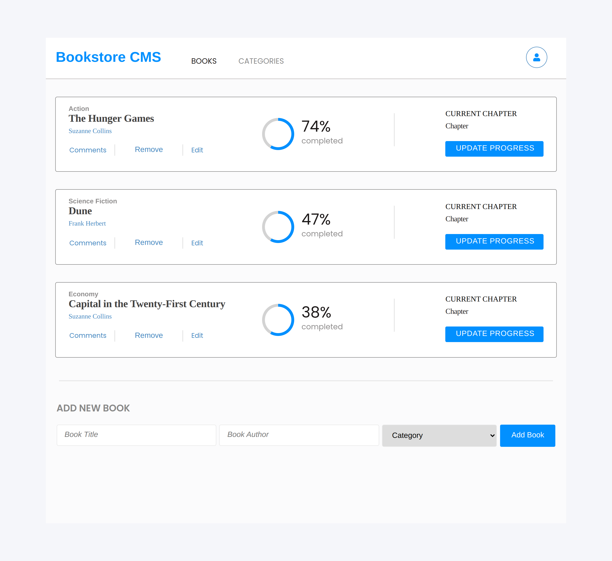

# Bookstore App

> This project was bootstrapped with [Create React App](https://github.com/facebook/create-react-app).

> "Bookstore" is a simple website built with `REACT` and `REDUX` that displays a list of books from an API and allows you to add and remove books in the API store.

## Built With

- 
- 
- 
- 
- 

## Live Demo (if available)

[Live Demo Link](https://livedemo.com)

## Getting Started

To get the content of this project locally you need to run this command in your terminal:

- `git clone https://github.com/cynthiainga/bookstore.git`
- `cd bookstore`
- `npm install` To download all the dependancies of the project
- Use `npm start` to run the app in your browser

## Test

For tracking linter errors locally you need to follow these steps:

- After cloning the project make sure you have run this command

  > `npm install` command

- For tracking the linter errors in CSS file run:

  > `npx stylelint "\*_/_.{css,scss}"`

- And For tracking the linter errors in JavaScript file run:

  > `npx eslint .`

- Use `npm run build` to run the app in live server

## Author

👤 **Cynthia Inga**

- GitHub: [@cynthiainga](https://github.com/cynthiainga)
- LinkedIn: [cynthia-inga7](https://www.linkedin.com/in/cynthia-inga/)
- Twitter: [@CynthiaInga_C](https://twitter.com/CynthiaInga_C)

## :handshake: Contributing

Feel free to check the [issues page](https://github.com/cynthiainga/bookstore/issues)

## Show your support

Give a :star: if you like this project!

## Acknowledgments

- Thanks to everyone who will get time to check this code especially to code reviewers.
- Thanks [Zeplin](https://app.zeplin.io/project/5b35a9e13227086040f8eb75/screen/5b695e29bb8c844f118f9378) for the template design.

## 📝 License

This project is [MIT](./MIT.md) licensed.
